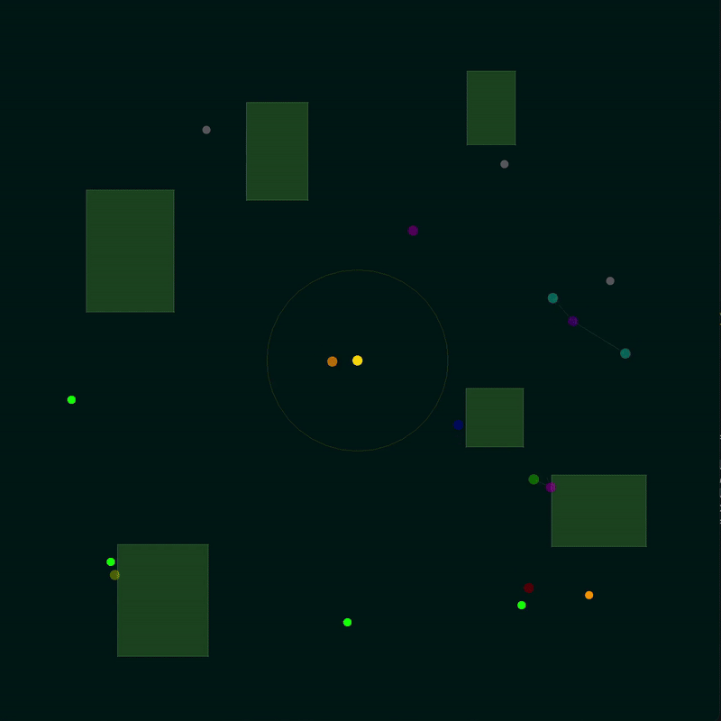

# PufferDroneSwarm

High-throughput multi-agent SAR benchmark with comm-limited swarm coordination and optional obstacle occlusion.



## Features

- **Multi-agent continuous control**: (vx, vy, scan) per drone
- **Relay behavior**: limited-range comm graph to base
- **SAR loop**: scan, confirm, and deliver victims
- **Obstacles**: axis-aligned rectangles with collision + LOS occlusion
- **Fast**: C core + PufferLib vectorization

## Installation

```bash
git clone <repo-url>
cd PufferDroneSwarm

# Install with uv (recommended)
uv sync

# Or with pip
pip install -e .
```

## Build the C Extension

```bash
uv run python setup.py build_ext --inplace --force
```

## Quick Start

```python
import numpy as np
import pufferlib.vector
from configs import get_env_config
from puffer_drone_swarm import env_creator

cfg = get_env_config("wilderness_hard")

vecenv = pufferlib.vector.make(
    env_creator('drone_swarm'),
    num_envs=4,
    backend=pufferlib.vector.Serial,
    config=cfg,
)

obs, _ = vecenv.reset()
for _ in range(100):
    actions = np.random.uniform(-1, 1, (vecenv.num_agents, 3)).astype(np.float32)
    obs, rewards, terminals, truncations, infos = vecenv.step(actions)
```

## Training / Evaluation / Rendering

```bash
# Train
uv run python examples/train.py

# Evaluate
uv run python examples/eval.py

# Render (raylib)
uv run python examples/render_policy.py
```

## Presets

Environment presets live in `configs.py`. These are defaults for reproducibility.
Override rewards or create new presets for your own experiments.

## Documentation

| Doc | Contents |
| --- | --- |
| `docs/MODEL_LOG.md` | Model architecture + training runs |
| `docs/ROADMAP.md` | Ideas and future work |
| `docs/project.md` | Design notes and spec |

## Environment Details

- **Observation**: 10 base features + `3 * obs_n_nearest` victim detections + `3 * obs_n_obstacles` obstacle features
- **Action**: `[vx, vy, scan]`, each in `[-1, 1]` (scan > 0 triggers sensing)
- **Benchmark**: `examples/bench_env.py`

## Project Structure

```
PufferDroneSwarm/
├── env_config.py          # Environment configuration
├── legacy/                # Legacy Python env + pygame viewer
├── puffer_drone_swarm.py  # PufferLib wrapper
├── policy.py              # Model definition (GRU policy)
├── configs.py             # Environment presets
├── examples/              # Training/eval/render scripts
├── docs/project.md        # Detailed project spec
└── pyproject.toml         # Dependencies
```
